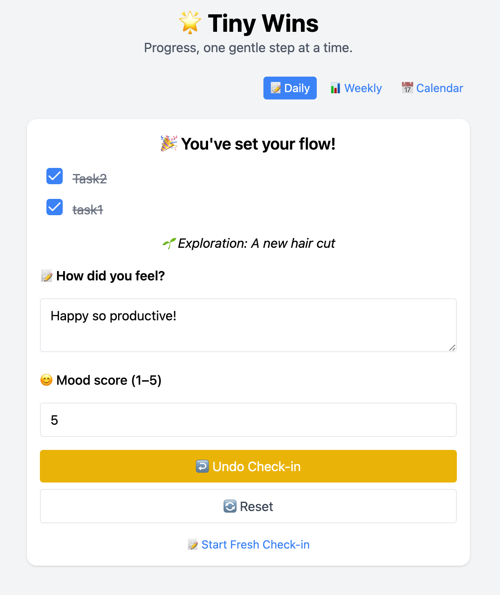

# Tiny Wins 🌟

A simple, minimalist habit tracker that helps you focus on daily progress and celebrate your small victories.

## About

Tiny Wins is a personal productivity app designed to help you build consistency through daily routines. Rather than overwhelming yourself with complex goal-setting, Tiny Wins focuses on the power of small, daily actions and celebrating incremental progress.





## Features

- **Daily Planning**: Set up to 3 anchor tasks for each day
- **Exploration Prompts**: Add something new to try each day
- **Daily Reflection**: Journal about your experiences and insights
- **Mood Tracking**: Record your daily mood ratings
- **Progress Visualization**: Track your completed tasks and mood in weekly charts
- **Calendar View**: See your monthly progress with color-coded task completion stats
- **Easy Navigation**: Switch between daily, weekly, and calendar views at any time
- **Local Storage**: Your data is stored privately in your browser

## How to Use

1. **Plan Your Day**: In the Daily View, set your anchor tasks and exploration prompt
2. **Track Completion**: Check off tasks as you complete them
3. **Record Your Mood**: Rate how you feel and add journal reflections
4. **Review Progress**: Switch to Weekly View to see charts of your mood and task completion
5. **Monthly Overview**: Use Calendar View to spot patterns and consistency, 
click any date in the calendar view to navigate back to daily view and create or edit entries

## Privacy

Tiny Wins respects your privacy:
- All data is stored locally in your browser
- No account creation required
- No data is sent to any servers
- Your information stays on your device

## Development

This project was built with:
- React
- Recharts for data visualization
- TailwindCSS for styling

### Running Locally

If you want to run this project locally:

```bash
# Clone the repository
git clone https://github.com/Fionayjx/tiny-wins.git

# Navigate to project directory
cd tiny-wins

# Install dependencies
npm install

# Start the development server
npm start